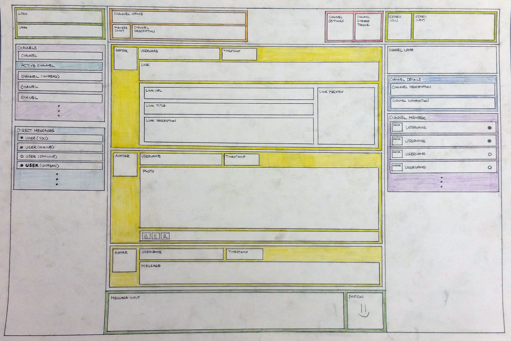

# SlackOff


SlackOff is a clone of a popular chat client, Slack.

Live Site: [http://slackoff.today]

## Implementation

SlackOff utilizes the following:

- Ruby on Rails
- React.js
- Redux
- PostgreSQL
- jQuery
- Heroku
- BCrypt
- Figaro
- jBuilder
- react-modal
- react-alert

## Features

The chat application is composed of three main features:

### Authentication

BCrypt gem is utilized in order to hash a password, and only the digest of the user is saved into the database.  A cookie storing a BCrypt token is used to keep track of the user's current session.  Without a valid matching session token, the user is redirected to the login page.  

### Live Chat

Pusher API is utilized for maintaining a Websocket TCP-based protocol connection which allows bi-directional communication between the server and the client.  


```javascript
this.pusher = new Pusher('// API KEY //', {
  encrypted: true
});

const channelId = this.props.user.currentChannel.toString();
this.channel = this.pusher.subscribe(channelId);

this.channel.bind('message', (data.message) => {
  this.props.receiveMessage(data.message);
}, this);

this.channel.bind('editMessage', (data) => {
  this.props.editMessage(data.message);
}, this);

this.channel.bind('deleteMessage', (data) => {
  this.props.removeMessage(data.messageId);
}, this);
```

When a user accesses the main application page, the client is subscribed to the Pusher channel.  From this channel, the client receives a specified event such as `message`, `editMessage` and `deleteMessage`.  The message event triggers the `receiveMessage` action which updates the application's Redux store through the reducer.  Once the store updates, React re-renders the chat view through the utilization of the virtual DOM.

```ruby
class Api::MessagesController < ApplicationController
  def create
    Pusher.trigger(@channel.id, 'message', {
      messages: new_message
    })
  end
end
```

The Rails backend receives the request from the AJAX thunk action generated by the frontend, retrieves the data from the PostgresSQL database, and then constructs a JSON response to be returned through Pusher.

### Channels


Public channels can be created/joined/subscribed by all users of the application.  A user can have many channels and a channel can have many users through a subscription join table.

```javascript
this.channel = this.pusher.subscribe('channels');

this.channel.bind('update', (data) => {
  this.props.receiveChannel(data.channel);
}, this);
```

When a channel name is changed, the changed name is broadcasted to all the clients for a real-time update of the changes made.


A user can browse through all the channels through the Channels View.  

```javascript
constructor(props) {
  this.state = {
    channels: [],
    searchInput: ''
  };
}

handleInput(e) {
  this.setState({ searchInput: e.target.value });
}

matches() {
  return this.state.channels.filter((channel) => channel.name.includes(this.state.searchInput));
}
```

The auto-completion for the channels search is implemented by updating the state of the channel list with the user's search input.

### Direct/Team Messaging


A user can send a direct message to another user or multiple users in the application.

```ruby
create_table "channels", force: :cascade do |t|
  t.boolean  "private", default: false
end
```

Direct and Team messaging capability is implemented through creation of private channels.


```javascript
this.channel = this.pusher.subscribe('directMessage');

this.channel.bind('notify', (data) => {
  if(data.private === true
     && data.authorId !== this.props.user.id
     && data.channelId !== this.props.channel.id) {
    this.showDirectMessageAlert(data.author);
  }
}, this);
```

when a new message is dispatched through Pusher from the Rails backend, an alert popup is displayed to notify the user that a new direct message was received. This alert, created with react-alert package, is only triggered when the channel the user is currently browsing is not the channel the user is currently viewing.

## Design

### Wireframe




A detailed wireframe was produced during the earliest stages of the planning. Each color represents a React container, and each box represents a different React component. All of the necessary dimensions and the relative positional values have been measured on the wireframe. The wireframe was crucial to accelerating the implementation of the visual.

### UI/UX

```javascript
<ReactCSSTransitionGroup
  transitionName='list'
  transitionEnterTimeout={500}
  transitionLeaveTimeout={500}>
  { this.buildChannelItems() }
</ReactCSSTransitionGroup>
```

```css
.list-enter {
  opacity: 0.01;
  transform: translateY(500%);
}

.list-enter.list-enter-active {
  opacity: 1;
  transform: translateY(0);
  transition: opacity 150ms ease-in, transform 150ms ease-in;
}

.list-leave {
  opacity: 1;
  transform: translateY(0);
}

.list-leave.list-leave-active {
  opacity: 0.01;
  transform: translateY(500%);
  transition: opacity 150ms ease-in, transform 150ms ease-in;
}
```

SlackOff is designed with satisfying UI/UX in mind.  Through React animation API, smooth transitional effects have been implemented to visually notify the user that he or she is interacting with an actionable item.  The usage of SCSS assures a streamlined workflow, and helps achieve the consistent overall visual of the website.

## Future Release

* [X] Notification
* [ ] Avatar Upload
* [ ] Messages Search
* [ ] Emoticons
* [ ] Multiple Sessions
